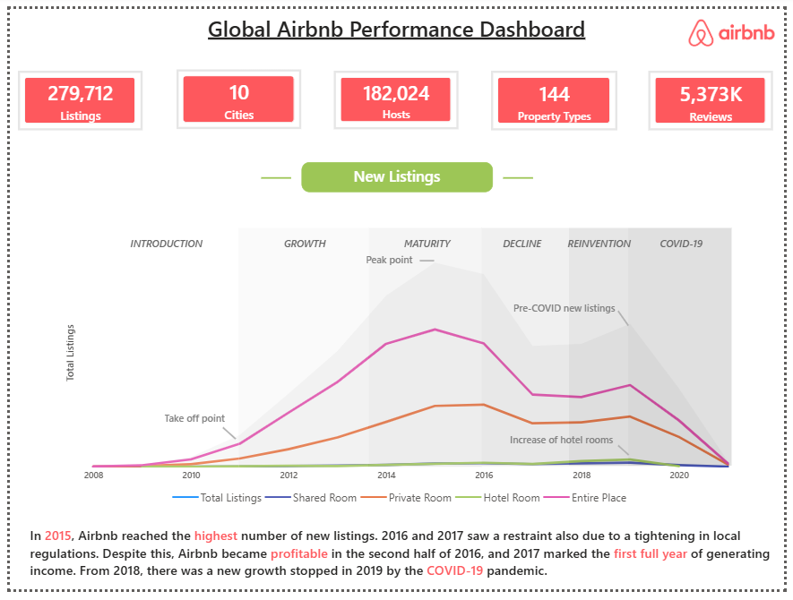
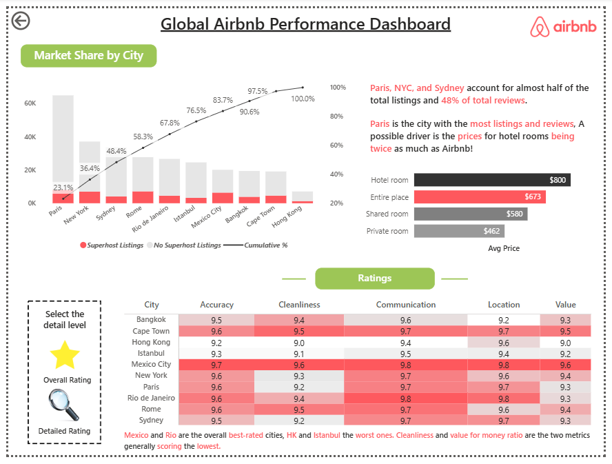
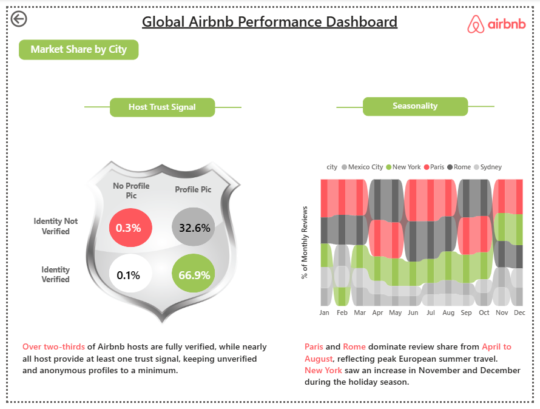

# Global-Airbnb-Performance-Dashboard
Power BI dashboard analyzing Airbnb listings, pricing, host performance, and seasonal trends.

## 🌍 Global Airbnb Performance Dashboard – Power BI

---

An advanced Power BI dashboard analyzing Airbnb’s global performance across listings, pricing, host behavior, customer satisfaction, and seasonal trends.

This project focuses on transforming raw Airbnb data into meaningful insights that can support business decisions in pricing strategy, customer experience, and market expansion.

---

## 📌 Project Overview

---

This dashboard provides a **holistic analysis of Airbnb’s ecosystem**, covering:

- Growth of listings over time  
- Market share across major global cities  
- Pricing patterns across room types  
- Host trust & verification signals  
- Customer satisfaction through ratings  
- Review trends and seasonality  

The goal is to uncover **key drivers of performance** in the Airbnb marketplace.

---

## 📂 Dataset Overview

---

The analysis is based on two datasets:

### 🔹 Listings Dataset
Includes:
- Property details (room type, bedrooms, accommodates)  
- Pricing (price, avg price)  
- Location (city, neighbourhood, district, coordinates)  
- Host attributes (superhost, verification, response rate)  
- Review scores (cleanliness, communication, accuracy, value, location)  

### 🔹 Reviews Dataset
Includes:
- Review activity over time  
- Monthly and cumulative review trends  
- Reviewer engagement metrics  

---

## 📊 Key KPIs

---

- 🏠 Total Listings: **279,712**  
- 🌍 Cities Covered: **10**  
- 👤 Total Hosts: **182,024**  
- 🏢 Property Types: **144**  
- 📝 Total Reviews: **5,373K**  

---

## 🔍 Key Insights

---

- In 2015, Airbnb reached the highest number of new listings, followed by a slowdown due to regulatory tightening in 2016–2017.  
- Airbnb became profitable in the second half of 2016, with 2017 marking its first full year of income generation.  
- Growth resumed after 2018 but declined sharply in 2019 due to the COVID-19 pandemic.  

- Paris, NYC, and Sydney account for nearly half of total listings and 48% of total reviews, showing strong market concentration.  
- Paris leads in both listings and reviews, potentially driven by significantly higher hotel room pricing.    

- Mexico City and Rio are the best-rated cities, while Hong Kong and Istanbul rank lower in overall satisfaction.  
- Cleanliness and value for money are the lowest-scoring dimensions across most cities.  

- Over two-thirds of hosts are fully verified, and most hosts provide at least one trust signal, ensuring platform reliability.  
- Fully verified hosts with profile pictures dominate the platform, while anonymous or unverified hosts form a very small portion.  

- Strong seasonality patterns exist:  
  - Paris and Rome dominate review share from April to August (summer travel peak)  
  - New York peaks in November and December during the holiday season  

---

## 🖼️ Dashboard Preview

---

Below is a preview of the Power BI dashboard showcasing Airbnb performance analysis:

🔗 **View Dashboard Preview:**  
[Open Dashboard Preview (Images)]

  
  
  

*(For full interactivity, please open the `.pbix` file in Power BI Desktop.)*

---

## 🛠️ Tools & Technologies

---

- Power BI  
- Power Query  
- DAX (Advanced Measures & Calculations)  
- Data Modeling (Multiple Tables – Listings & Reviews)  
- Data Visualization  

---

## 📁 Files Included

---

- [Download Power BI Dashboard (.pbix)](https://drive.google.com/file/d/1xeETDCtY7M3HQi1KcyB7aXm6yBaVdA8f/view?usp=sharing) 
- Dashboard preview images (included in repository)

---

## 🚀 Learnings

---

- Built a **multi-table data model** with relationships  
- Applied **time intelligence (seasonality, cumulative metrics)**  
- Designed **business-focused KPIs and storytelling dashboards**  
- Used **DAX for advanced calculations (percentages, segmentation, trends)**  
- Analyzed **customer behavior, pricing, and trust factors**  
- Created a dashboard with **clear narrative flow (Overview → Ratings → Reviews)**  

---

## 👤 Author

---

**Surbhi Sharma**  
Aspiring Data Analyst  

---

## 📬 Feedback

---

Feedback and suggestions are always welcome!  
Feel free to connect on Linkedin and share your thoughts.
